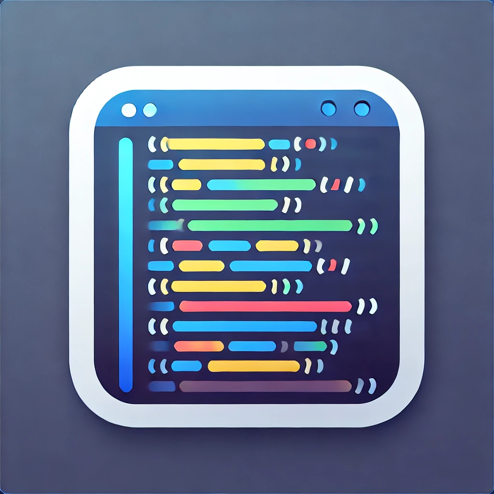

# Highlight Code – VS Code Extension



Highlight Code lets you quickly mark important sections of source files with vibrant colors so you can present, teach, or revisit critical snippets with ease. Highlights persist per file, can be restored after reloads, and are fully controllable through simple commands.

---

## ✨ Features

- **Persistent color highlights** that survive editor reloads and file switches.
- **Palette picker** with curated colors plus support for custom hex inputs.
- **One-click cleanup** for either the active editor or the entire workspace.
- **Selective removal** so you can clear just the highlight under your current selection.

---

## 📸 Preview


The screenshot above shows two highlighted sections in different colors. Use this view as a reference for how the extension renders decorations in VS Code.

---

## ⚡ Quick Start

1. Install the extension (or clone this repo and run it via `F5` in VS Code).
2. Select any text and press `Cmd/Ctrl+Shift+H` to highlight it.
3. Change colors with `Cmd/Ctrl+Shift+M`.
4. Manage highlights using the shortcuts below.

---

## ⌨️ Commands & Shortcuts

| Command                                   | macOS Shortcut     | Windows/Linux Shortcut | Description                                                   |
|-------------------------------------------|--------------------|------------------------|---------------------------------------------------------------|
| `extension.highlightText`                 | `Cmd+Shift+H`      | `Ctrl+Shift+H`         | Highlight the current selection using the configured color.   |
| `extension.selectHighlightColor`          | `Cmd+Shift+M`      | `Ctrl+Shift+M`         | Open the color picker to choose a highlight color.            |
| `extension.clearAllHiglightsInCurrentFile`| `Cmd+Shift+L`      | `Ctrl+Shift+L`         | Remove every highlight in the active editor.                  |
| `extension.clearHighlightForSelectedRange`| `Cmd+Shift+D`      | `Ctrl+Shift+D`         | Remove the highlight covering the current selection.          |
| `extension.clearAllHighlights`            | `Cmd+Shift+G`      | `Ctrl+Shift+G`         | Clear all highlights across the entire workspace.             |

All commands are also available through the Command Palette by searching for “Highlight”.

---

## 🎛️ Settings

| Setting                                | Type     | Default             | Description                                                              |
|----------------------------------------|----------|---------------------|--------------------------------------------------------------------------|
| `highlightExtension.highlightColor`    | `string` | `rgba(255,255,0,0.2)` | Overrides the color applied when highlighting (supports CSS color values). |

To change the color:

1. Open **Settings** (`Cmd/Ctrl+,` or `File → Preferences → Settings`).
2. Search for `Highlight Extension`.
3. Adjust `highlightExtension.highlightColor`, e.g.:

```json
"highlightExtension.highlightColor": "rgba(255, 99, 71, 0.4)"
```

---

## 🧪 Development

1. Clone the repo and run `npm install`.
2. Press `F5` inside VS Code to launch the Extension Development Host.
3. Use `npm run test` to run the extension tests.

Contributions and suggestions are welcome! Please open issues for bugs or feature ideas.

---

## 🗒️ Release Notes

- **1.0.5** – Fixed highlight persistence, added selective removal command, refreshed shortcuts.
- **1.0.4** – Added full-workspace clearing and quality-of-life improvements.
- **1.0.3** – Color picker enhancements and stability fixes.
- **1.0.2 (planned)** – Integration with “Find in Files”.
- **1.0.1** – Added icon and individual highlight removal.
- **1.0.0** – Initial release with highlighting and color selection.

---

Enjoy highlighting! 🎨
